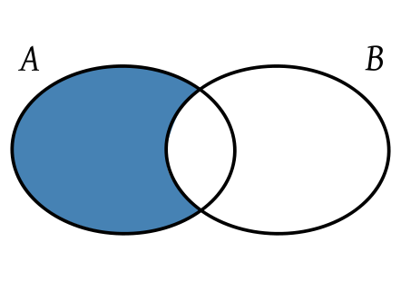
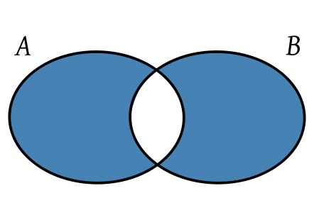

# JSExcellent-Q-A
The Questions and answers from stackoverflow!

### [Get random item from JavaScript array](//stackoverflow.com/questions/5915096/get-random-item-from-javascript-array)

**Q:**

How do I get random item form `items`?

    var items = Array(523,3452,334,31,...5346);

**A**:

    var item = items[Math.floor(Math.random() * items.length)];

### [Generate random number between two numbers in JavaScript](//stackoverflow.com/questions/4959975/generate-random-number-between-two-numbers-in-javascript)

**Q:**

Is there a way to generate a random number in a specified range (e.g. from `1` to `6`: `1`, `2`, `3`, `4`, `5`, or `6`) in JavaScript?

**A:**

If you wanted to get between `1` and `6`, you would calculate:

    Math.floor(Math.random() * 6) + 1

Where:

- `1` is the start number
- `6` is the number of possible results `(1 + start (6) - end (1))`

What it does "extra" is it allows random intervals that do not start with `1`. So you can get a random number from `10` to `15` for example. Flexibility.

    function randomIntFromInterval(min,max){
        return Math.floor(Math.random() * (max - min + 1) + min);
    }

### [How to print a number with commas as thousands separators in JavaScript](//stackoverflow.com/questions/2901102/how-to-print-a-number-with-commas-as-thousands-separators-in-javascript)

**Q:**

I am trying to print an integer in JavaScript with commas as thousands separators. For example, I want to show the number `1234567` as `1,234,567`. How would I go about doing this?

**A:**

    function numberWithCommas(x) {
        return x.toString().replace(/\B(?=(\d{3})+(?!\d))/g, ",")
    }

@neu-rah mentioned that this function adds commas in undesirable places if there are more than 3 digits after the decimal point. If this is a problem, you can use this function:

    function numberWithCommas(x) {
        var parts = x.toString().split(".");
        parts[0] = parts[0].replace(/\B(?=(\d{3})+(?!\d))/g, ",");
        return parts.join(".");
    }

### [Generate random string/characters in JavaScript](//stackoverflow.com/questions/1349404/generate-random-string-characters-in-javascript)

**Q:**

I want a 5 character string composed of characters picked randomly from the set `[a-zA-Z0-9]`. What's the best way to do this with JavaScript?

**A:**

    function makeid() {
        var text = "";
        var possible = "ABCDEFGHIJKLMNOPQRSTUVWXYZabcdefghijklmnopqrstuvwxyz0123456789";

        for (var i = 0; i < 5; i++)
            text += possible.charAt(Math.floor(Math.random() * possible.length));

            return text;
    }

or:

    Math.random().toString(36).substring(7);

or:

    Math.random().toString(36).substr(2, 5);

### [How to redirect to another webpage in JavaScript/jQuery?](//stackoverflow.com/questions/503093/how-to-redirect-to-another-webpage-in-javascript-jquery)

**Q:**

How can i redirect the user from one page to another using JavaScript or jQuery?

**A:**

If you want to simulate someone clicking on a link, use `location.href`.

If you want to simulate an HTTP redirect, use `location.replace`.

    // similar behavior as an HTTP redirect
    window.location.replace("http://stackoverflow.com");

    // similar behavior as clicking on a link
    window.location.href = "http://stackoverflow.com";

### [Safely turning a JSON string into an object](//stackoverflow.com/questions/45015/safely-turning-a-json-string-into-an-object)

**Q:**

Given a string of JSON data, how can you safely turn that string into a JavaScript object?

**A:**

    JSON.parse(jsonString);

Is a pure JavaScript approach so long as you can require a reasonably modern browser.

### [Convert JS object to JSON string](//stackoverflow.com/questions/4162749/convert-js-object-to-json-string)

**Q:**

If I defined an object in JS with:

    var j={"name":"binchen"};

How can I convert the object to JSON? The output string should be:

    '{"name":"binchen"}'

**A:**

All current browsers have native JSON support built in. So as long as you're not dealing with prehistoric browsers like IE6/7 you can do it just as easily as that:

    var j={"name":"binchen"};
    JSON.stringify(j); // '{"name":"binchen"}'

### [Object comparison in JavaScript](//stackoverflow.com/questions/1068834/object-comparison-in-javascript)

**Q:**

What is the best way to compare objects in JavaScript?

Example:

    var user1 = {name : "nerd", org: "dev"};
    var user2 = {name : "nerd", org: "dev"};
    var eq = user1 == user2;
    alert(eq); // gives false

I know that **two objects are equal if they refer to the exact same object**, but is there a way to check if they have the same attributes' values?

**A:**

Unfortunately there is no perfect way, unless you use `_proto_` recursively and access all non-enumerable properties, but this works in Firefox only.

So the best I can do is to guess usage scenarios.

**1) Fast and limited.**

Works when you have simple JSON-style objects without methods and DOM nodes inside:

    JSON.stringify(obj1) === JSON.stringify(obj2)

The ORDER of the properties IS IMPORTANT, so this method will return false for following objects:

    x = {a: 1, b: 2};
    y = {b: 2, a: 1};

**2) Slow and more generic.**

Compares objects without digging into prototypes, then compares properties' projections recursively, and also compares constructors.

This is almost correct algorithm:

    function deepCompare () {
        var i, l, leftChain, rightChain;

        function compare2Objects (x, y) {
            var p;

            // remember that NaN === NaN returns false
            // and isNaN(undefined) returns true
            if (isNaN(x) && isNaN(y) && typeof x === 'number' && typeof y === 'number'){
                return true;
            }

            // Compare primitives and functions.
            // Check if both arguments link to the same object.
            // Especially useful on the step where we compare prototypes
            if (x === y) {
                return true;
            }

            // Works in case when functions are created in constructor.
            // Comparing dates is a common scenario. Another built-ins?
            // We can even handle functions passed across iframes
            if ((typeof x === 'function' && typeof y === 'function') ||
            (x instanceof Date && y instanceof Date) ||
            (x instanceof RegExp && y instanceof RegExp) ||
            (x instanceof String && y instanceof String) ||
            (x instanceof Number && y instanceof Number)) {
                return x.toString() === y.toString();
            }

            // At last checking prototypes as good as we can
            if (!(x instanceof Object && y instanceof Object)) {
                return false;
            }

            if (x.isPrototypeOf(y) || y.isPrototypeOf(x)) {
                return false;
            }

            if (x.constructor !== y.constructor) {
                return false;
            }

            if (x.prototype !== y.prototype) {
                return false;
            }

            // Check for infinitive linking loops
            if (leftChain.indexOf(x) > -1 || rightChain.indexOf(y) > -1) {
                return false;
            }

            // Quick checking of one object being a subset of another.
            // todo: cache the structure of arguments[0] for performance
            for (p in y) {
                if (y.hasOwnProperty(p) !== x.hasOwnProperty(p)) {
                    return false;
                }
                else if (typeof y[p] !== typeof x[p]) {
                    return false;
                }
            }

            for (p in x) {
                if (y.hasOwnProperty(p) !== x.hasOwnProperty(p)) {
                    return false;
                }
                else if (typeof y[p] !== typeof x[p]) {
                    return false;
                }

                switch (typeof (x[p])) {
                    case 'object':
                    case 'function':

                        leftChain.push(x);
                        rightChain.push(y);

                        if (!compare2Objects (x[p], y[p])) {
                            return false;
                        }

                        leftChain.pop();
                        rightChain.pop();
                        break;

                    default:
                        if (x[p] !== y[p]) {
                            return false;
                        }
                        break;
                }
            }

            return true;
        }

        if (arguments.length < 1) {
            return true; //Die silently? Don't know how to handle such case, please help...
            // throw "Need two or more arguments to compare";
        }

        for (i = 1, l = arguments.length; i < l; i++) {

            leftChain = []; //Todo: this can be cached
            rightChain = [];

            if (!compare2Objects(arguments[0], arguments[i])) {
                return false;
            }
        }

        return true;
    }

Known issues (well, they have very low priority, probably you'll never notice them):

- objects with different prototype structure but same projection
- functions may have identical text but refer to different closures

Tests: passes tests are from [How to determine equality for two JavaScript objects?](//stackoverflow.com/a/16788517/139361).

### [How to randomize (shuffle) a JavaScript array?](//stackoverflow.com/questions/2450954/how-to-randomize-shuffle-a-javascript-array)

**Q:**

I have one array like this:

    var arr1 = ["a", "b", "c", "d"];

How can I randomize / shuffle it?

**A:**

The de-facto unbiased shuffle algorithm is the Fisher-Yates (aka Knuth) Shuffle. See [https://github.com/coolaj86/knuth-shuffle](//github.com/coolaj86/knuth-shuffle)

You can see a [great visualization here](//bost.ocks.org/mike/shuffle/) (and the original post [linked to this](//sedition.com/perl/javascript-fy.html))

    function shuffle(array) {
        var currentIndex = array.length, temporaryValue, randomIndex;

        // While there remain elements to shuffle...
        while (0 !== currentIndex) {

            // Pick a remaining element...
            randomIndex = Math.floor(Math.random() * currentIndex);
            currentIndex -= 1;

            // And swap it with the current element.
            temporaryValue = array[currentIndex];
            array[currentIndex] = array[randomIndex];
            array[randomIndex] = temporaryValue;
        }

        return array;
    }

    // Used like so
    var arr = [2, 11, 37, 42];
    arr = shuffle(arr);
    console.log(arr);

Some more info [about the algorithm](//en.wikipedia.org/wiki/Fisher-Yates_shuffle) used.

### [Create a JavaScript array containing 1…N](//stackoverflow.com/questions/3746725/create-a-javascript-array-containing-1-n)

**Q:**

I'm looking for any alternatives to the below for creating a JavaScript array containing `1` through to `N` where `N` is only known at runtime.

    var foo = [];

    for (var i = 1; i <= N; i++) {
        foo.push(i);
    }

To me it feels like there should be a way of doing this without the loop.

**A:**

You can do so:

    var N = 10;
    Array.apply(null, {length: N}).map(Number.call, Number)

> result: [0, 1, 2, 3, 4, 5, 6, 7, 8, 9]

or with random values:

    Array.apply(null, {length: N}).map(Function.call, Math.random)

> result: [0.7082694901619107, 0.9572225909214467, 0.8586748542729765, 0.8653848143294454, 0.008339877473190427, 0.9911756622605026, 0.8133423360995948, 0.8377588465809822, 0.5577575915958732, 0.16363654541783035]

**Explanation**

First, note that `Number.call(undefined, N)` is equivalent to `Number(N)`, which just returns `N`. We'll use that fact later.

`Array.apply(null, [undefined, undefined, undefined])` is equivalent to `Array(undefined, undefined, undefined)`, which produces a three-element array and assigns `undefined` to each element.

How can you generalize that to N elements? Consider how [`Array()`](//developer.mozilla.org/en-US/docs/Web/JavaScript/Reference/Global_Objects/Array) works, which goes something like this:

    function Array() {
        if ( arguments.length == 1 &&
            'number' === typeof arguments[0] &&
            arguments[0] >= 0 && arguments &&
            arguments[0] < 1 << 32 ) {
            return [ … ];  // array of length arguments[0], generated by native code
        }
        var a = [];
        for (var i = 0; i < arguments.length; i++) {
            a.push(arguments[i]);
        }
        return a;
    }

[Since ECMAScript 5](//developer.mozilla.org/en-US/docs/Web/JavaScript/Reference/Global_Objects/Function/apply), `Function.prototype.apply(thisArg, argsArray)` also accepts a duck-typed array-like object as its second parameter. If we invoke `Array.apply(null, { length: N })`, then it will execute

    function Array() {
        var a = [];
        for (var i = 0; i < /* arguments.length = */ N; i++) {
            a.push(/* arguments[i] = */ undefined);
        }
        return a;
    }

Now we have an N-element array, with each element set to `undefined`. When we call [`.map(callback, thisArg)`](//developer.mozilla.org/en-US/docs/Web/JavaScript/Reference/Global_Objects/Array/map) on it, each element will be set to the result of `callback.call(thisArg, element, index, array)`. Therefore, `[undefined, undefined, …, undefined].map(Number.call, Number)` would map each element to `(Number.call).call(Number, undefined, index, array)`, which is the same as `Number.call(undefined, index, array)`, which, as we observed earlier, evaluates to `index`. That completes the array whose elements are the same as their index.

Why go through the trouble of `Array.apply(null, {length: N})` instead of just `Array(N)`? After all, both expressions would result an an N-element array of undefined elements. The difference is that in the former expression, each element is explicitly set to undefined, whereas in the latter, each element was never set. According to the documentation of [`.map()`](//developer.mozilla.org/en-US/docs/Web/JavaScript/Reference/Global_Objects/Array/map):

> `callback` is invoked only for indexes of the array which have assigned values; it is not invoked for indexes which have been deleted or which have never been assigned values.

Therefore, `Array(N)` is insufficient; `Array(N).map(Number.call, Number)` would result in an uninitialized array of length N.

**Compatibility**

Since this technique relies on behaviour of `Function.prototype.apply()` specified in ECMAScript 5, it will [not work](//developer.mozilla.org/en-US/docs/Web/JavaScript/Reference/Global_Objects/Function/apply#Description) in pre-ECMAScript 5 browsers such as Chrome 14 and Internet Explorer 9.

In ES6 using Array [`from()`](//developer.mozilla.org/en-US/docs/Web/JavaScript/Reference/Global_Objects/Array/from) and [`keys()`](//developer.mozilla.org/en-US/docs/Web/JavaScript/Reference/Global_Objects/Array/keys) methods.

    Array.from(Array(10).keys())
    //=> [0, 1, 2, 3, 4, 5, 6, 7, 8, 9]

Shorter version using [spread operator](//developer.mozilla.org/en-US/docs/Web/JavaScript/Reference/Operators/Spread_operator).

    [...Array(10).keys()]
    //=> [0, 1, 2, 3, 4, 5, 6, 7, 8, 9]

In ES6 you can do:

    Array(N).fill().map((e,i)=>i+1);

> Changed `Array(45)` to `Array(N)` since you've updated the question.

### [Javascript add leading zeroes to date](https://stackoverflow.com/questions/3605214/javascript-add-leading-zeroes-to-date)

**Q:**

I've created this script to calculate the data for `10` days in advance in the formate of `dd/mm/yyyy`:

    var MyDate = new Date();
    var MyDateString = new Date();
    MyDate.setDate(MyDate.getDate() + 10);
    MyDateString = MyDate.getDate() + '/' + (MyDate.getMonth() + 1) + '/' + MyDate.getFullYear();

I need to have the date appear with leading zeroes on the day and month component by way of adding these rules to the script. I can't seem to get it to work.

    if (MyDate.getMonth > 10) getMonth = '0' + getMonth;

and

    if (MyDate.getDate < 10) get.Date = '0' + getDate;

If someone could show me where to insert these into the script I would be really appreciative.

**A:**

[Try this](//jsfiddle.net/xA5B7/):

    var MyDate = new Date();
    var MyDateString;

    MyDate.setDate(MyDate.getDate() + 20);
    MyDateString = ('0' + MyDate.getDate()).slice(-2) + '/' + ('0' + (MyDate.getMonth() + 1)).slice(-2) + '/' + MyDate.getFullYear();

**EDIT:**

To explain, `.slice(-2)` gives us the last two characters of the string.

So no matter what, we can add `"0"` to the day or month, and just ask for the last two since those are always the two we want.

So if the `MyDate.getMonth()` returns `9`, it will be:

    ("0" + "9") // Giving us "09"

so adding `.slice(-2)` on that gives us the last two characters which is:

    ("0" + "9").slice(-2);
    // "09"

But if `MyDate.getMonth()` returns `10`, it will be:

    ("0" + "10") // Giving us "010"

so adding `.slice(-2)` gives us the last two characters, or:

    ("0" + "10").slice(-2)
    // "10"

### [Why does parseInt(1/0, 19) return 18?](//stackoverflow.com/questions/11340673/why-does-parseint1-0-19-return-18)

**Q:**

I've an annoying problem in JavaScript.

    > parseInt(1 / 0, 19)
    > 18

Why does `parseInt` return `18`?

**A:**

The result of `1/0` is [`Infinity`](//developer.mozilla.org/en/JavaScript/Reference/Global_Objects/Infinity).

[`parseInt`](//developer.mozilla.org/en/JavaScript/Reference/Global_Objects/parseInt) treats its first argument as a string which means first of all `Infinity.toString()` is called, producing the string `"Infinity"`. So it works the same as if you asked it to convert `"Infinity"` in base `19` to decimal.

Here are the digits in base `19` along with their decimal values:

    Base 19   Base 10 (decimal)
    ---------------------------
    0            0
    1            1
    2            2
    3            3
    4            4
    5            5
    6            6
    7            7
    8            8
    9            9
    a            10
    b            11
    c            12
    d            13
    e            14
    f            15
    g            16
    h            17
    i            18

What happens next is that `parseInt` scans the input `"Infinity"` to find which part of it can be parsed and stops after accepting the first `I` (because `n` is not a valid digit in base `19`).

Therefore it behaves as if you called `parseInt("I", 19)`, which converts to decimal `18` by the table above.

### [Is object empty?](//stackoverflow.com/questions/4994201/is-object-empty)

**Q:**

What is the fastest way to check if an object is empty or not?

Is there a faster and better way than this:

    function count_obj(obj){
        var i = 0;
        for(var key in obj){
            ++i;
        }

        return i;
    }

**A:**

I'm assuming that by empty you mean "has no properties of its own".

    // Speed up calls to hasOwnProperty
    var hasOwnProperty = Object.prototype.hasOwnProperty;

    function isEmpty(obj) {

        // null and undefined are "empty"
        if (obj == null) return true;

        // Assume if it has a length property with a non-zero value
        // that that property is correct.
        if (obj.length > 0)    return false;
        if (obj.length === 0)  return true;

        // If it isn't an object at this point
        // it is empty, but it can't be anything *but* empty
        // Is it empty?  Depends on your application.
        if (typeof obj !== "object") return true;

        // Otherwise, does it have any properties of its own?
        // Note that this doesn't handle
        // toString and valueOf enumeration bugs in IE < 9
        for (var key in obj) {
            if (hasOwnProperty.call(obj, key)) return false;
        }

        return true;
    }

Examples:

    isEmpty(""), // true
    isEmpty(33), // true (arguably could be a TypeError)
    isEmpty([]), // true
    isEmpty({}), // true
    isEmpty({length: 0, custom_property: []}), // true

    isEmpty("Hello"), // false
    isEmpty([1,2,3]), // false
    isEmpty({test: 1}), // false
    isEmpty({length: 3, custom_property: [1,2,3]}) // false

If you only need to handle ECMAScript5 browsers, you can use `Object.getOwnPropertyNames` instead of the `hasOwnProperty` loop:

    if (Object.getOwnPropertyNames(obj).length > 0) return false;

This will ensure that even if the object only has non-enumerable properties `isEmpty` will still give you the correct results.

[ECMA 5+:](//developer.mozilla.org/en-US/docs/Web/JavaScript/Reference/Global_Objects/Object/keys#Browser_compatibility)

    // because Object.keys(new Date()).length === 0;
    // we have to do some additional check
    Object.keys(obj).length === 0 && obj.constructor === Object

Pre-ECMA 5:

    function isEmpty(obj) {
        for(var prop in obj) {
            if(obj.hasOwnProperty(prop))
                return false;
        }

        return JSON.stringify(obj) === JSON.stringify({});
    }

There's no easy way to do this. You'll have to loop over the properties explicitly:

    function isEmpty(obj) {
        for(var prop in obj) {
            if(obj.hasOwnProperty(prop))
                return false;
        }

        return true;
    }

If [ECMAScript 5 support](//developer.mozilla.org/en-US/docs/Web/JavaScript/Reference/Global_Objects/Object/keys#Browser_compatibility) is available, you can use `Object.keys()` instead:

    function isEmpty(obj) {
        return Object.keys(obj).length === 0;
    }

### [Unique values in an array](//stackoverflow.com/questions/1960473/unique-values-in-an-array)

**Q:**

I have an array of numbers that I need to make sure are unique. I found the code snippet below on the internet and it works great until the array has a zero in it. I found [this other script](//stackoverflow.com/questions/1890203/unique-for-arrays-in-javascript) here on SO that looks almost exactly like it, but it doesn't fail.

So for the sake of helping me learn, can someone help me determine where the prototype script is going wrong?

    Array.prototype.getUnique = function() {
        var o = {}, a = [], i, e;
        for (i = 0; e = this[i]; i++) {o[e] = 1};
        for (e in o) {a.push (e)};
        return a;
    }

**A:**

With JavaScript 1.6 / ECMAScript 5 you can use the native `filter` method of an Array in the following way to get an array with unique values:

    function onlyUnique(value, index, self) {
        return self.indexOf(value) === index;
    }

    // usage example:
    var a = ['a', 1, 'a', 2, '1'];
    var unique = a.filter( onlyUnique ); // returns ['a', 1, 2, '1']

The native method `filter` will loop through the array and leave only those entries that pass the given callback function `onlyUnique`.

`onlyUnique` checks, if the given value is the first occurring. If not, it must be a duplicate and will not be copied.

This solution works without any extra library like jQuery or prototype.js.

It works for arrays with mixed value types too.

For old Browsers (`<ie9`), that do not support the native methods `filter` and `indexOf` you can find work arounds in the MDN documentation for `filter` and `indexOf`.

If you want to keep the last occurrence of a value, simple replace `indexOf` by `lastIndexOf`.

With ES6 it could be shorten to this:

    // usage example:
    var myArray = ['a', 1, 'a', 2, '1'];
    var unique = myArray.filter((v, i, a) => a.indexOf(v) === i);

    // unique is ['a', 1, 2, '1']

Thanks to [Camilo Martin](//stackoverflow.com/users/124119/camilo-martin) for hint in comment.

ES6 has a native object `Set` to store unique values. To get an array with unique values you could do now this:

    var myArray = ['a', 1, 'a', 2, '1'];

    let unique = [...new Set(myArray)];

    // unique is ['a', 1, 2, '1']

The constructor of `Set` takes an iterable object, like Array, and the spread operator `...` transform the set back into an Array. Thanks to Lukas Liese for hint in comment.

### [RGB to Hex and Hex to RGB](//stackoverflow.com/questions/5623838/rgb-to-hex-and-hex-to-rgb)

**Q:**

How to convert colors in RGB format to Hex format and vice versa? For example, convert `'#0080C0'` to `(0, 128, 192)`.

**A:**

The following will do to the RGB to hex conversion and add any required zero padding:

    function componentToHex(c) {
        var hex = c.toString(16);
        return hex.length == 1 ? "0" + hex : hex;
    }

    function rgbToHex(r, g, b) {
        return "#" + componentToHex(r) + componentToHex(g) + componentToHex(b);
    }

    alert( rgbToHex(0, 51, 255) ); // #0033ff

Converting the other way:

    function hexToRgb(hex) {
        var result = /^#?([a-f\d]{2})([a-f\d]{2})([a-f\d]{2})$/i.exec(hex);
        return result ? {
            r: parseInt(result[1], 16),
            g: parseInt(result[2], 16),
            b: parseInt(result[3], 16)
        } : null;
    }

    alert( hexToRgb("#0033ff").g ); // "51";

Finally, an alternative version of `rgbToHex()`, as discussed in @casablanca's answer and suggested in the comments by @cwolves:

    function rgbToHex(r, g, b) {
        return "#" + ((1 << 24) + (r << 16) + (g << 8) + b).toString(16).slice(1);
    }

**Update 3 December 2012:**

Here's a version of `hexToRgb()` that also parses a shorthand hex triplet such as `"#03F"`:

    function hexToRgb(hex) {
        // Expand shorthand form (e.g. "03F") to full form (e.g. "0033FF")
        var shorthandRegex = /^#?([a-f\d])([a-f\d])([a-f\d])$/i;
        hex = hex.replace(shorthandRegex, function(m, r, g, b) {
            return r + r + g + g + b + b;
        });

        var result = /^#?([a-f\d]{2})([a-f\d]{2})([a-f\d]{2})$/i.exec(hex);
        return result ? {
            r: parseInt(result[1], 16),
            g: parseInt(result[2], 16),
            b: parseInt(result[3], 16)
        } : null;
    }

    alert( hexToRgb("#0033ff").g ); // "51";
    alert( hexToRgb("#03f").g ); // "51";

### [Javascript reduce on array of objects](//stackoverflow.com/questions/5732043/javascript-reduce-on-array-of-objects)

**Q:**

Say I want to sum `a.x` for each element in `arr`.

    arr = [{x:1},{x:2},{x:4}]
    arr.reduce(function(a,b){return a.x + b.x})
    >> NaN

I have cause to believe that `a.x` is `undefined` at some point.

The following works fine

    arr = [1,2,4]
    arr.reduce(function(a,b){return a + b})
    >> 7

What am I doing wrong in the first example?

**A:**

After the first iteration your're returning a number and then trying to get property `x` of it to add to the next object which is `undefined` and maths involving `undefined` results in `NaN`.

try returning an object contain an `x` property with the sum of the x properties of the parameters:

    var arr = [{x:1},{x:2},{x:4}];

    arr.reduce(function (a, b) {
    return {x: a.x + b.x}; // returns object with property x
    })

    // ES6
    arr.reduce((a, b) => ({x: a.x + b.x}));

    // -> {x: 7}

Explanation added from comments:

The return value of each iteration of `[].reduce` used as the a variable in the next iteration.

Iteration 1: `a = {x:1}`, `b = {x:2}`, `{x: 3}` assigned to `a` in Iteration 2

Iteration 2: `a = {x:3}`, `b = {x:4}`.

The problem with your example is that you're returning a number literal.

    function (a, b) {
    return a.x + b.x; // returns number literal
    }

Iteration 1: `a = {x:1}`, `b = {x:2}`, `// returns 3` as `a` in next iteration

Iteration 2: `a = 3`, `b = {x:2}` returns `NaN`

A number literal `3` does not (typically) have a property called `x` so it's `undefined` and  `undefined + b.x` returns `NaN` and `NaN + <anything>` is always `NaN`

> Clarification: I prefer my method over the other top answer in this thread as I disagree with the idea that passing an option parameter to reduce with a magic number to get out a number primitive is cleaner. It may result in fewer lines written but imo it is less readable.

### [Check if a variable is a string](//stackoverflow.com/questions/4059147/check-if-a-variable-is-a-string)

**Q:**

How can I determine whether a variable is a string or something else in JavaScript?

**A:**

This is what works for me:

    if (typeof myVar === 'string' || myVar instanceof String)
    // it's a string
    else
    // it's something else

### [Convert Array to Object](//stackoverflow.com/questions/4215737/convert-array-to-object)

**Q:**

What is the best way to convert:

    ['a','b','c']

to:

    {
        0: 'a',
        1: 'b',
        2: 'c'
    }

**A:**

With a function like this:

    function toObject(arr) {
        var rv = {};
        for (var i = 0; i < arr.length; ++i)
            rv[i] = arr[i];
        return rv;
    }

Your array already is more-or-less just an object, but arrays do have some "interesting" and special behavior with respect to integer-named properties. The above will give you a plain object.

edit oh also you might want to account for "holes" in the array:

    function toObject(arr) {
        var rv = {};
        for (var i = 0; i < arr.length; ++i)
            if (arr[i] !== undefined) rv[i] = arr[i];
        return rv;
    }

In modern JavaScript runtimes, you can use the `.reduce()` method:

    var obj = arr.reduce(function(acc, cur, i) {
        acc[i] = cur;
        return acc;
    }, {});

That one also avoids "holes" in the array, because that's how `.reduce()` works.

### [Stop setInterval call in JavaScript](//stackoverflow.com/questions/109086/stop-setinterval-call-in-javascript)

**Q:**

I am using `setInterval(fname, 10000);` to call a function every `10` seconds in JavaScript. Is it possible to stop calling it on some event?

I want the user to be able to stop the repeated refresh of data.

**A:**

`setInterval()` returns an interval ID, which you can pass to `clearInterval()`:

    var refreshIntervalId = setInterval(fname, 10000);

    /* later */
    clearInterval(refreshIntervalId);

See the docs for [`setInterval()`](//developer.mozilla.org/en/DOM/window.setInterval) and [`clearInterval()`](//developer.mozilla.org/en/DOM/window.clearInterval).

### [How do I get the name of an object's type in JavaScript?](//stackoverflow.com/questions/332422/how-do-i-get-the-name-of-an-objects-type-in-javascript)

**Q:**

Is there a JavaScript equivalent of Java's `class.getName()`?

**A:**

> Is there a JavaScript equivalent of Java's `class.getName()`?

**No.**

But here are various hacks that all fall down in one way or another:

Here is a hack that will do what you need - be aware that it modifies the Object's prototype, something people frown upon (usually for good reason)

    Object.prototype.getName = function() {
        var funcNameRegex = /function (.{1,})\(/;
        var results = (funcNameRegex).exec((this).constructor.toString());
        return (results && results.length > 1) ? results[1] : "";
    };

Now, all of your objects will have the function, `getName()`, that will return the name of the constructor as a string. I have tested this in `FF3` and `IE7`, I can't speak for other implementations.

If you don't want to do that, here is a discussion on the various ways of determining types in JavaScript...

I recently updated this to be a bit more exhaustive, though it is hardly that. Corrections welcome...

**Using the `constructor` property...**

Every `object` has a value for its `constructor` property, but depending on how that `object` was constructed as well as what you want to do with that value, it may or may not be useful.

Generally speaking, you can use the `constructor` property to test the type of the object like so:

    var myArray = [1,2,3];
    (myArray.constructor == Array); // true

So, that works well enough for most needs. That said...

**Caveats**

**Will not work AT ALL in many cases**

This pattern, though broken, is quite common:

    function Thingy() {
    }
    Thingy.prototype = {
        method1: function() {
        },
        method2: function() {
        }
    };

`Objects` constructed via `new Thingy` will have a `constructor` property that points to `Object`, not `Thingy`. So we fall right at the outset; you simply cannot trust `constructor` in a codebase that you don't control.

**Multiple Inheritance**

An example where it isn't as obvious is using multiple inheritance:

    function a() { this.foo = 1;}
    function b() { this.bar = 2; }
    b.prototype = new a(); // b inherits from a

Things now don't work as you might expect them to:

    var f = new b(); // instantiate a new object with the b constructor
    (f.constructor == b); // false
    (f.constructor == a); // true

So, you might get unexpected results if the `object` your testing has a different `object` set as its `prototype`. There are ways around this outside the scope of this discussion.

There are other uses for the `constructor` property, some of them interesting, others not so much; for now we will not delve into those uses since it isn't relevant to this discussion.

**Will not work cross-frame and cross-window**

Using `.constructor` for type checking will break when you want to check the type of objects coming from different `window` objects, say that of an iframe or a popup window. This is because there's a different version of each core type `constructor` in each `window`, i.e.

    iframe.contentWindow.Array === Array // false

**Using the `instanceof` operator...**

The `instanceof` operator is a clean way of testing `object` type as well, but has its own potential issues, just like the `constructor` property.

    var myArray = [1,2,3];
    (myArray instanceof Array); // true
    (myArray instanceof Object); // true

But `instanceof` fails to work for literal values (because literals are not `Objects`)

    3 instanceof Number // false
    'abc' instanceof String // false
    true instanceof Boolean // false

The literals need to be wrapped in an `Object` in order for `instanceof` to work, for example

    new Number(3) instanceof Number // true

The `.constructor` check works fine for literals because the `.` method invocation implicitly wraps the literals in their respective object type

    3..constructor === Number // true
    'abc'.constructor === String // true
    true.constructor === Boolean // true

Why two dots for the 3? Because Javascript interprets the first dot as a decimal point ;)

**Will not work cross-frame and cross-window**

`instanceof` also will not work across different windows, for the same reason as the `constructor` property check.

**Using the `name` property of the `constructor` property...**

**Does not work AT ALL in many cases**

Again, see above; it's quite common for `constructor` to be utterly and completely wrong and useless.

**Does NOT work in <IE9**

Using `myObjectInstance.constructor.name` will give you a string containing the name of the `constructor` function used, but is subject to the caveats about the `constructor` property that were mentioned earlier.

For IE9 and above, you can [monkey-patch in support](//matt.scharley.me/2012/03/monkey-patch-name-ie.html):

    if (Function.prototype.name === undefined && Object.defineProperty !== undefined) {
        Object.defineProperty(Function.prototype, 'name', {
            get: function() {
                var funcNameRegex = /function\s+([^\s(]+)\s*\(/;
                var results = (funcNameRegex).exec((this).toString());
                return (results && results.length > 1) ? results[1] : "";
            },
            set: function(value) {}
        });
    }

**Updated version** from the article in question. This was added 3 months after the article was published, this is the recommended version to use by the article's author Matthew Scharley. This change was inspired by [comments pointing out potential pitfalls](//matt.scharley.me/2012/03/monkey-patch-name-ie.html#comment-551654096) in the previous code.

    if (Function.prototype.name === undefined && Object.defineProperty !== undefined) {
        Object.defineProperty(Function.prototype, 'name', {
            get: function() {
                var funcNameRegex = /function\s([^(]{1,})\(/;
                var results = (funcNameRegex).exec((this).toString());
                return (results && results.length > 1) ? results[1].trim() : "";
            },
            set: function(value) {}
        });
    }

**Using `Object.prototype.toString`**

It turns out, as [this post details](//perfectionkills.com/instanceof-considered-harmful-or-how-to-write-a-robust-isarray/), you can use `Object.prototype.toString` - the low level and generic implementation of `toString` - to get the type for all built-in types

    Object.prototype.toString.call('abc') // [object String]
    Object.prototype.toString.call(/abc/) // [object RegExp]
    Object.prototype.toString.call([1,2,3]) // [object Array]

One could write a short helper function such as

    function type(obj){
        return Object.prototype.toString.call(obj).slice(8, -1);
    }

to remove the cruft and get at just the type name

    type('abc') // String

However, it will return `Object` for all user-defined types.

**Caveats for all...**

All of these are subject to one potential problem, and that is the question of how the object in question was constructed. Here are various ways of building objects and the values that the different methods of type checking will return:

    // using a named function:
    function Foo() { this.a = 1; }
    var obj = new Foo();
    (obj instanceof Object);          // true
    (obj instanceof Foo);             // true
    (obj.constructor == Foo);         // true
    (obj.constructor.name == "Foo");  // true

    // let's add some prototypical inheritance
    function Bar() { this.b = 2; }
    Foo.prototype = new Bar();
    obj = new Foo();
    (obj instanceof Object);          // true
    (obj instanceof Foo);             // true
    (obj.constructor == Foo);         // false
    (obj.constructor.name == "Foo");  // false

    // using an anonymous function:
    obj = new (function() { this.a = 1; })();
    (obj instanceof Object);              // true
    (obj.constructor == obj.constructor); // true
    (obj.constructor.name == "");         // true

    // using an anonymous function assigned to a variable
    var Foo = function() { this.a = 1; };
    obj = new Foo();
    (obj instanceof Object);      // true
    (obj instanceof Foo);         // true
    (obj.constructor == Foo);     // true
    (obj.constructor.name == ""); // true

    // using object literal syntax
    obj = { foo : 1 };
    (obj instanceof Object);            // true
    (obj.constructor == Object);        // true
    (obj.constructor.name == "Object"); // true

While not all permutations are present in this set of examples, hopefully there are enough to provide you with an idea about how messy things might get depending on your needs. Don't assume anything, if you don't understand exactly what you are after, you may end up with code breaking where you don't expect it to because of a lack of grokking the subtleties.

> **NOTE:**Discussion of the `typeof` operator may appear to be a glaring omission, but it really isn't useful in helping to identify whether an `object` is a given type, since it is very simplistic. Understanding where `typeof` is useful is important, but I don't currently feel that it is terribly relevant to this discussion. My mind is open to change though. :)

### [Static variables in JavaScript](//stackoverflow.com/questions/1535631/static-variables-in-javascript)

**Q:**

How can I create static variables in Javascript?

**A:**

If you come from a class-based, strongly typed object-oriented language (like Java, C++ or C#) I assume that you are trying to create a variable or method associated to a "type" but not to an instance.

An example using a "classical" approach, with constructor functions maybe could help you to catch the concepts of basic OO JavaScript:

    function MyClass () { // constructor function
    var privateVariable = "foo";  // Private variable

    this.publicVariable = "bar";  // Public variable

    this.privilegedMethod = function () {  // Public Method
        alert(privateVariable);
    };
    }

    // Instance method will be available to all instances but only load once in memory
    MyClass.prototype.publicMethod = function () {
    alert(this.publicVariable);
    };

    // Static variable shared by all instances
    MyClass.staticProperty = "baz";

    var myInstance = new MyClass();

`staticProperty` is defined in the `MyClass` object (which is a function) and has nothing to do with its created instances, JavaScript treats functions as [first-class objects](//en.wikipedia.org/wiki/First-class_function), so being an object, you can assign properties to a function.

### [How to find the sum of an array of numbers](//stackoverflow.com/questions/1230233/how-to-find-the-sum-of-an-array-of-numbers)

**Q:**

Given an array `[1, 2, 3, 4]`, how can I find the sum of its elements? (In this case, the sum would be `10`.)

I thought [`$.each`](//api.jquery.com/jquery.each/) might be useful, but I'm not sure how to implement it.

**A:**

In [Lisp](//en.wikipedia.org/wiki/Lisp_%28programming_language%29), this'd be exactly the job for reduce. You'd see this kind of code:

    (reduce #'+ '(1 2 3)) ; 6

Fortunately, in JavaScript, we also have [`reduce`](//developer.mozilla.org/en-US/docs/JavaScript/Reference/Global_Objects/Array/Reduce)! Unfortunately, `+` is an operator, not a function. But we can make it pretty! Here, look:

    var sum = [1, 2, 3].reduce(add, 0);

    function add(a, b) {
        return a + b;
    }

    console.log(sum); // 6

Isn't that pretty? :-)

Even better! If you're using ECMAScript 2015 (aka [ECMAScript 6](//en.wikipedia.org/wiki/ECMAScript#Harmony.2C_6th_Edition)), it can be this pretty:

    var sum = [1, 2, 3].reduce((a, b) => a + b, 0);
    console.log(sum); // 6

### [How do I remove a property from a JavaScript object?](//stackoverflow.com/questions/208105/how-do-i-remove-a-property-from-a-javascript-object)

**Q:**

Say I create an object as follows:

    var myObject = {
        "ircEvent": "PRIVMSG",
        "method": "newURI",
        "regex": "^http://.*"
    };

What is the best way to remove the property `regex` to end up with new `myObject` as follows?

    var myObject = {
        "ircEvent": "PRIVMSG",
        "method": "newURI"
    };

**A:**

Like this:

    delete myObject.regex;
    // or,
    delete myObject['regex'];
    // or,
    var prop = "regex";
    delete myObject[prop];

For anyone interested in reading more about it, Stack Overflow user [kangax](//stackoverflow.com/users/130652/kangax) has written an incredibly in-depth blog post about the `delete` statement on their blog, [Understanding `delete`](//perfectionkills.com/understanding-delete/). It is highly recommended.

### [How can I get last characters of a string using JavaScript](//stackoverflow.com/questions/5873810/how-can-i-get-last-characters-of-a-string-using-javascript)

**Q:**

I have

    var id="ctl03_Tabs1";

Using JavaScript, how might I get the last five characters or last character?

**A:**

You'll want to use the Javascript string method `.substr()` combined with the `.length` property.

    var id = "ctl03_Tabs1";
    var lastFive = id.substr(id.length - 5); // => "Tabs1"
    var lastChar = id.substr(id.length - 1); // => "1"

This gets the characters starting at `id.length - 5` and, since the second argument for `.substr()` is omitted, continues to the end of the string.

You can also use the `.slice()` method as others have pointed out below.

If you're simply looking to find the characters after the underscore, you could use this:

    var tabId = id.split("_").pop(); // => "Tabs1"

This splits the string into an array on the underscore and then "pops" the last element off the array (which is the string you want).

### [Detecting a mobile browser](//stackoverflow.com/questions/11381673/detecting-a-mobile-browser)

**Q:**

I'm looking for a function which return boolean value if user has mobile browser or not.

I know that I can use `navigator.userAgent` and write that function by using regex, but user-agents are too various for different platforms. I doubt that match all possible devices would be easy, and I think this problem has been solved before many times so there should be some kind of complete solution for such task.

I was looking at [this site](//detectmobilebrowsers.com/), but sadly the script is so cryptic that I have no idea how to use it for my purpose, which is to create a function which return true / false.

**A:**

**Using Regex (from [detectmobilebrowsers.com](//detectmobilebrowsers.com/)):**

Here's a function that uses an insanely long and comprehensive regex which returns a true or false value depending on whether or not the user is browsing with a mobile.

    window.mobilecheck = function() {
        var check = false;
        (function(a){if(/(android|bb\d+|meego).+mobile|avantgo|bada\/|blackberry|blazer|compal|elaine|fennec|hiptop|iemobile|ip(hone|od)|iris|kindle|lge |maemo|midp|mmp|mobile.+firefox|netfront|opera m(ob|in)i|palm( os)?|phone|p(ixi|re)\/|plucker|pocket|psp|series(4|6)0|symbian|treo|up\.(browser|link)|vodafone|wap|windows ce|xda|xiino/i.test(a)||/1207|6310|6590|3gso|4thp|50[1-6]i|770s|802s|a wa|abac|ac(er|oo|s\-)|ai(ko|rn)|al(av|ca|co)|amoi|an(ex|ny|yw)|aptu|ar(ch|go)|as(te|us)|attw|au(di|\-m|r |s )|avan|be(ck|ll|nq)|bi(lb|rd)|bl(ac|az)|br(e|v)w|bumb|bw\-(n|u)|c55\/|capi|ccwa|cdm\-|cell|chtm|cldc|cmd\-|co(mp|nd)|craw|da(it|ll|ng)|dbte|dc\-s|devi|dica|dmob|do(c|p)o|ds(12|\-d)|el(49|ai)|em(l2|ul)|er(ic|k0)|esl8|ez([4-7]0|os|wa|ze)|fetc|fly(\-|_)|g1 u|g560|gene|gf\-5|g\-mo|go(\.w|od)|gr(ad|un)|haie|hcit|hd\-(m|p|t)|hei\-|hi(pt|ta)|hp( i|ip)|hs\-c|ht(c(\-| |_|a|g|p|s|t)|tp)|hu(aw|tc)|i\-(20|go|ma)|i230|iac( |\-|\/)|ibro|idea|ig01|ikom|im1k|inno|ipaq|iris|ja(t|v)a|jbro|jemu|jigs|kddi|keji|kgt( |\/)|klon|kpt |kwc\-|kyo(c|k)|le(no|xi)|lg( g|\/(k|l|u)|50|54|\-[a-w])|libw|lynx|m1\-w|m3ga|m50\/|ma(te|ui|xo)|mc(01|21|ca)|m\-cr|me(rc|ri)|mi(o8|oa|ts)|mmef|mo(01|02|bi|de|do|t(\-| |o|v)|zz)|mt(50|p1|v )|mwbp|mywa|n10[0-2]|n20[2-3]|n30(0|2)|n50(0|2|5)|n7(0(0|1)|10)|ne((c|m)\-|on|tf|wf|wg|wt)|nok(6|i)|nzph|o2im|op(ti|wv)|oran|owg1|p800|pan(a|d|t)|pdxg|pg(13|\-([1-8]|c))|phil|pire|pl(ay|uc)|pn\-2|po(ck|rt|se)|prox|psio|pt\-g|qa\-a|qc(07|12|21|32|60|\-[2-7]|i\-)|qtek|r380|r600|raks|rim9|ro(ve|zo)|s55\/|sa(ge|ma|mm|ms|ny|va)|sc(01|h\-|oo|p\-)|sdk\/|se(c(\-|0|1)|47|mc|nd|ri)|sgh\-|shar|sie(\-|m)|sk\-0|sl(45|id)|sm(al|ar|b3|it|t5)|so(ft|ny)|sp(01|h\-|v\-|v )|sy(01|mb)|t2(18|50)|t6(00|10|18)|ta(gt|lk)|tcl\-|tdg\-|tel(i|m)|tim\-|t\-mo|to(pl|sh)|ts(70|m\-|m3|m5)|tx\-9|up(\.b|g1|si)|utst|v400|v750|veri|vi(rg|te)|vk(40|5[0-3]|\-v)|vm40|voda|vulc|vx(52|53|60|61|70|80|81|83|85|98)|w3c(\-| )|webc|whit|wi(g |nc|nw)|wmlb|wonu|x700|yas\-|your|zeto|zte\-/i.test(a.substr(0,4))) check = true;})(navigator.userAgent||navigator.vendor||window.opera);
        return check;
    };

For those wishing to include tablets in this test (though arguably, you shouldn't), you can use the following function:

    window.mobileAndTabletcheck = function() {
        var check = false;
        (function(a){if(/(android|bb\d+|meego).+mobile|avantgo|bada\/|blackberry|blazer|compal|elaine|fennec|hiptop|iemobile|ip(hone|od)|iris|kindle|lge |maemo|midp|mmp|mobile.+firefox|netfront|opera m(ob|in)i|palm( os)?|phone|p(ixi|re)\/|plucker|pocket|psp|series(4|6)0|symbian|treo|up\.(browser|link)|vodafone|wap|windows ce|xda|xiino|android|ipad|playbook|silk/i.test(a)||/1207|6310|6590|3gso|4thp|50[1-6]i|770s|802s|a wa|abac|ac(er|oo|s\-)|ai(ko|rn)|al(av|ca|co)|amoi|an(ex|ny|yw)|aptu|ar(ch|go)|as(te|us)|attw|au(di|\-m|r |s )|avan|be(ck|ll|nq)|bi(lb|rd)|bl(ac|az)|br(e|v)w|bumb|bw\-(n|u)|c55\/|capi|ccwa|cdm\-|cell|chtm|cldc|cmd\-|co(mp|nd)|craw|da(it|ll|ng)|dbte|dc\-s|devi|dica|dmob|do(c|p)o|ds(12|\-d)|el(49|ai)|em(l2|ul)|er(ic|k0)|esl8|ez([4-7]0|os|wa|ze)|fetc|fly(\-|_)|g1 u|g560|gene|gf\-5|g\-mo|go(\.w|od)|gr(ad|un)|haie|hcit|hd\-(m|p|t)|hei\-|hi(pt|ta)|hp( i|ip)|hs\-c|ht(c(\-| |_|a|g|p|s|t)|tp)|hu(aw|tc)|i\-(20|go|ma)|i230|iac( |\-|\/)|ibro|idea|ig01|ikom|im1k|inno|ipaq|iris|ja(t|v)a|jbro|jemu|jigs|kddi|keji|kgt( |\/)|klon|kpt |kwc\-|kyo(c|k)|le(no|xi)|lg( g|\/(k|l|u)|50|54|\-[a-w])|libw|lynx|m1\-w|m3ga|m50\/|ma(te|ui|xo)|mc(01|21|ca)|m\-cr|me(rc|ri)|mi(o8|oa|ts)|mmef|mo(01|02|bi|de|do|t(\-| |o|v)|zz)|mt(50|p1|v )|mwbp|mywa|n10[0-2]|n20[2-3]|n30(0|2)|n50(0|2|5)|n7(0(0|1)|10)|ne((c|m)\-|on|tf|wf|wg|wt)|nok(6|i)|nzph|o2im|op(ti|wv)|oran|owg1|p800|pan(a|d|t)|pdxg|pg(13|\-([1-8]|c))|phil|pire|pl(ay|uc)|pn\-2|po(ck|rt|se)|prox|psio|pt\-g|qa\-a|qc(07|12|21|32|60|\-[2-7]|i\-)|qtek|r380|r600|raks|rim9|ro(ve|zo)|s55\/|sa(ge|ma|mm|ms|ny|va)|sc(01|h\-|oo|p\-)|sdk\/|se(c(\-|0|1)|47|mc|nd|ri)|sgh\-|shar|sie(\-|m)|sk\-0|sl(45|id)|sm(al|ar|b3|it|t5)|so(ft|ny)|sp(01|h\-|v\-|v )|sy(01|mb)|t2(18|50)|t6(00|10|18)|ta(gt|lk)|tcl\-|tdg\-|tel(i|m)|tim\-|t\-mo|to(pl|sh)|ts(70|m\-|m3|m5)|tx\-9|up(\.b|g1|si)|utst|v400|v750|veri|vi(rg|te)|vk(40|5[0-3]|\-v)|vm40|voda|vulc|vx(52|53|60|61|70|80|81|83|85|98)|w3c(\-| )|webc|whit|wi(g |nc|nw)|wmlb|wonu|x700|yas\-|your|zeto|zte\-/i.test(a.substr(0,4))) check = true;})(navigator.userAgent||navigator.vendor||window.opera);
        return check;
    };

**The Original Answer**

You can do this by simply running through a list of devices and checking if the useragent matches anything like so:

    function detectmob() { 
        if( navigator.userAgent.match(/Android/i)
        || navigator.userAgent.match(/webOS/i)
        || navigator.userAgent.match(/iPhone/i)
        || navigator.userAgent.match(/iPad/i)
        || navigator.userAgent.match(/iPod/i)
        || navigator.userAgent.match(/BlackBerry/i)
        || navigator.userAgent.match(/Windows Phone/i)
        ){
            return true;
        }
        else {
            return false;
        }
    }

However since you believe that this method is unreliable, You could assume that any device that had a resolution of`800x600` or less was a mobile device too, narrowing your target even more (although these days many mobile devices have much greater resolutions than this)

i.e

    function detectmob() {
        if(window.innerWidth <= 800 && window.innerHeight <= 600) {
            return true;
        } else {
            return false;
        }
    }

**Reference:**

- [Detecting Browser and Devices with javascript](//www.quirksmode.org/js/detect.html)

### [How do I check if an object has a property in JavaScript?](//stackoverflow.com/questions/135448/how-do-i-check-if-an-object-has-a-property-in-javascript)

**Q:**

How do I check if an object has a property in JavaScript?

Consider:

    x = {'key': 1};
    if ( x.hasOwnProperty('key') ) {
        //Do this
    }

Is that the best way to do it?

**A:**

I'm really confused by the answers that have been given - most of them are just outright incorrect. Of course you can have object properties that have `undefined`, `null`, or `false` values. So simply reducing the property check to typeof `this[property]` or, even worse, `x.key` will give you completely misleading results.

It depends on what you're looking for. If you want to know if an object physically contains a property (and it is not coming from somewhere up on the prototype chain) then `object.hasOwnProperty` is the way to go. All modern browsers support it. (It was missing in older versions of Safari - 2.0.1 and older - but those versions of the browser are rarely used any more.)

If what you're looking for is if an object has a property on it that is iterable (when you iterate over the properties of the object, it will appear) then doing: `prop in object` will give you your desired effect.

Since using `hasOwnProperty` is probably what you want, and considering that you may want a fallback method, I present to you the following solution:

    var obj = {
        a: undefined,
        b: null,
        c: false
    };

    // a, b, c all found
    for ( var prop in obj ) {
        document.writeln( "Object1: " + prop );
    }

    function Class(){
        this.a = undefined;
        this.b = null;
        this.c = false;
    }

    Class.prototype = {
        a: undefined,
        b: true,
        c: true,
        d: true,
        e: true
    };

    var obj2 = new Class();

    // a, b, c, d, e found
    for ( var prop in obj2 ) {
        document.writeln( "Object2: " + prop );
    }

    function hasOwnProperty(obj, prop) {
        var proto = obj.__proto__ || obj.constructor.prototype;
        return (prop in obj) &&
            (!(prop in proto) || proto[prop] !== obj[prop]);
    }

    if ( Object.prototype.hasOwnProperty ) {
        var hasOwnProperty = function(obj, prop) {
            return obj.hasOwnProperty(prop);
        }
    }

    // a, b, c found in modern browsers
    // b, c found in Safari 2.0.1 and older
    for ( var prop in obj2 ) {
        if ( hasOwnProperty(obj2, prop) ) {
            document.writeln( "Object2 w/ hasOwn: " + prop );
        }
    }

The above is a working, cross-browser, solution to `hasOwnProperty`, with one caveat: It is unable to distinguish between cases where an identical property is on the prototype and on the instance - it just assumes that it's coming from the prototype. You could shift it to be more lenient or strict, based upon your situation, but at the very least this should be more helpful.

### [Set a default parameter value for a JavaScript function](//stackoverflow.com/questions/894860/set-a-default-parameter-value-for-a-javascript-function)

**Q:**

I would like a JavaScript function to have optional arguments which I set a default on, which gets used if the value isn't defined. In Ruby you can do it like this:

    def read_file(file, delete_after = false)
        # code
    end

Does this work in JavaScript?

    function read_file(file, delete_after = false) {
        // Code
    }

**A:**

From ES6/ES2015, default parameters is in the language specification.

    function read_file(file, delete_after = false) {
        // Code
    }

just works.

Reference: [Default Parameters - MDN](//developer.mozilla.org/en/docs/Web/JavaScript/Reference/Functions/default_parameters)

> Default function parameters allow formal parameters to be initialized with default values if no value or `undefined` is passed.

You can also [simulate default named parameters via destructuring](//exploringjs.com/es6/ch_parameter-handling.html#sec_named-parameters):

    // the `= {}` below lets you call the function without any parameters
    function myFor({ start = 5, end = 1, step = -1 } = {}) { // (A)
        // Use the variables `start`, `end` and `step` here
        ···
    }

**Pre ES2015,**

There are a lot of ways, but this is my preferred method - it lets you pass in anything you want, including `false` or `null`. (`typeof null == "object"`)

    function foo(a, b){
        a = typeof a !== 'undefined' ? a : 42;
        b = typeof b !== 'undefined' ? b : 'default_b';
        ...
    }

### [Trim string in JavaScript?](//stackoverflow.com/questions/498970/trim-string-in-javascript)

**Q:**

How do I trim a string in JavaScript?

**A:**

Since new Browsers (IE9+) have `trim()` already implemented, you should only implement `trim()` if it is not already available on the Prototype-Object (overriding it is a huge performance hit). This is generally recommended when extending Native Objects! Note that the added property is enumerable unless you use ES5 `Object.defineProperty`!

For those browsers who does not support `trim()`, you can use this polyfill from [MDN](//developer.mozilla.org/en-US/docs/Web/JavaScript/Reference/Global_Objects/String/Trim):

    if (!String.prototype.trim) {
        (function() {
            // Make sure we trim BOM and NBSP
            var rtrim = /^[\s\uFEFF\xA0]+|[\s\uFEFF\xA0]+$/g;
            String.prototype.trim = function() {
                return this.replace(rtrim, '');
            };
        })();
    }

See this:

    String.prototype.trim=function(){return this.replace(/^\s+|\s+$/g, '');};

    String.prototype.ltrim=function(){return this.replace(/^\s+/,'');};

    String.prototype.rtrim=function(){return this.replace(/\s+$/,'');};

    String.prototype.fulltrim=function(){return this.replace(/(?:(?:^|\n)\s+|\s+(?:$|\n))/g,'').replace(/\s+/g,' ');};

### [Sorting an array of JavaScript objects](//stackoverflow.com/questions/979256/sorting-an-array-of-javascript-objects)

**Q:**

I read the following objects using Ajax and stored them in an array:

    var homes = [
        {
            "h_id": "3",
            "city": "Dallas",
            "state": "TX",
            "zip": "75201",
            "price": "162500"
        }, {
            "h_id": "4",
            "city": "Bevery Hills",
            "state": "CA",
            "zip": "90210",
            "price": "319250"
        }, {
            "h_id": "5",
            "city": "New York",
            "state": "NY",
            "zip": "00010",
            "price": "962500"
        }
    ];

How do I create a function to sort the objects by the `price` property in ascending or descending order using only JavaScript?

**Q:**

Sort `homes` by `price` in ascending order:

    homes.sort(function(a, b) {
        return parseFloat(a.price) - parseFloat(b.price);
    });

Some documentation can be found [here](//developer.mozilla.org/en/docs/Web/JavaScript/Reference/Global_Objects/Array/sort).

### [How to get all properties values of a Javascript Object (without knowing the keys)?](//stackoverflow.com/questions/7306669/how-to-get-all-properties-values-of-a-javascript-object-without-knowing-the-key)

**Q:**

If there is an Javascript object:

    var objects={...};

Suppose, it has more than `50` properties, without knowing the property names (that's without knowing the `keys`) how to get each property value in a loop?

**A:**

Depending on which browsers you have to support, this can be done in a number of ways. The overwhelming majority of browsers in the wild support ECMAScript 5 (ES5), but be warned that many of the examples below use `Object.keys`, which is not available in `IE < 9`. See the [compatibility table](//kangax.github.io/compat-table/es5/).

**ECMAScript 3+**

If you have to support older versions of IE, then this is the option for you:

    for (var key in obj) {
        if (Object.prototype.hasOwnProperty.call(obj, key)) {
            var val = obj[key];
            // use val
        }
    }

The nested `if` makes sure that you don't enumerate over properties in the prototype chain of the object (which is the behaviour you almost certainly want). You must use

    Object.prototype.hasOwnProperty.call(obj, key) // ok

rather than

    obj.hasOwnProperty(key) // bad

because ECMAScript 5+ allows you to create prototypeless objects with `Object.create(null)`, and these objects will not have the `hasOwnProperty` method. Naughty code might also produce objects which override the `hasOwnProperty` method.

**ECMAScript 5+**

You can use these methods in any browser that supports ECMAScript 5 and above. These get values from an object and avoid enumerating over the prototype chain. Where `obj` is your object:

    var keys = Object.keys(obj);

    for (var i = 0; i < keys.length; i++) {
        var val = obj[keys[i]];
        // use val
    }

If you want something a little more compact or you want to be careful with functions in loops, then `Array.prototype.forEach` is your friend:

    Object.keys(obj).forEach(function (key) {
        var val = obj[key];
        // use val
    });

The next method builds an array containing the values of an object. This is convenient for looping over.

    var vals = Object.keys(obj).map(function (key) {
        return obj[key];
    });

    // use vals array

If you want to make those using `Object.keys` safe against `null` (as `for-in` is), then you can do `Object.keys(obj || {})...`.

`Object.keys` returns enumerable properties. For iterating over simple objects, this is usually sufficient. If you have something with non-enumerable properties that you need to work with, you may use `Object.getOwnPropertyNames` in place of `Object.keys`.

**ECMAScript 2015+ (A.K.A. ES6)**

Arrays are easier to iterate with ECMAScript 2015. You can use this to your advantage when working with values one-by–one in a loop:

    for (const key of Object.keys(obj)) {
        const val = obj[key];
        // use val
    }

Using ECMAScript 2015 fat-arrow functions, mapping the object to an array of values becomes a one-liner:

    const vals = Object.keys(obj).map(key => obj[key]);

    // use vals array

ECMAScript 2015 introduces `Symbol`, instances of which may be used as property names. To get the symbols of an object to enumerate over, use `Object.getOwnPropertySymbols` (this function is why `Symbol` can't be used to make private properties). The new `Reflect` API from ECMAScript 2015 provides `Reflect.ownKeys`, which returns a list of property names (including non-enumerable ones) and symbols.

**Array comprehensions (do not attempt to use)**

Array comprehensions were removed from ECMAScript 6 before publication. Prior to their removal, a solution would have looked like:

    const vals = [for (key of Object.keys(obj)) obj[key]];

    // use vals array

**ECMAScript 2017+**

ECMAScript 2016 adds features which do not impact this subject. The ECMAScript 2017 specification adds `Object.values` and `Object.entries`. Both return arrays (which will be surprising to some given the analogy with `Array.entries`). `Object.values` can be used as is or with a `for-of` loop.

    const values = Object.values(obj);

    // use values array or:

    for (const val of Object.values(obj)) {
        // use val
    }

If you want to use both the key and the value, then `Object.entries` is for you. It produces an array filled with `[key, value]` pairs. You can use this as is, or (note also the ECMAScript 2015 destructuring assignment) in a `for-of` loop:

    for (const [key, val] of Object.entries(obj)) {
        // use key and val
    }

**`Object.values` shim**

Finally, as noted in the comments and by teh_senaus in another answer, it may be worth using one of these as a shim. Don't worry, the following does not change the prototype, it just adds a method to `Object` (which is much less dangerous). Using fat-arrow functions, this can be done in one line too:

    Object.values = obj => Object.keys(obj).map(key => obj[key]);

which you can now use like

    // ['one', 'two', 'three']
    var values = Object.values({ a: 'one', b: 'two', c: 'three' });

If you want to avoid shimming when a native `Object.values` exists, then you can do:

    Object.values = Object.values || (obj => Object.keys(obj).map(key => obj[key]));

**Finally...**

Be aware of the browsers/versions you need to support. The above are correct where the methods or language features are implemented. For example, support for ECMAScript 2015 was switched off by default in V8 until recently, which powered browsers such as Chrome. Features from ECMAScript 2015 should be be avoided until the browsers you intend to support implement the features that you need. If you use [babel](//babeljs.io/) to compile your code to ECMAScript 5, then you have access to all the features in this answer.

### [JavaScript array difference](//stackoverflow.com/questions/1187518/javascript-array-difference)

**Q:**

Is there a way to return the difference between two arrays in JavaScript?

For example:

    var a1 = ['a', 'b'];
    var a2 = ['a', 'b', 'c', 'd'];

    // need ["c", "d"]

Any advice greatly appreciated.

**A:**

    Array.prototype.diff = function(a) {
        return this.filter(function(i) {return a.indexOf(i) < 0;});
    };

    ////////////////////  
    // Examples  
    ////////////////////

    [1,2,3,4,5,6].diff( [3,4,5] );  
    // => [1, 2, 6]

    ["test1", "test2","test3","test4","test5","test6"].diff(["test1","test2","test3","test4"]);  
    // => ["test5", "test6"]

> Note `indexOf` and `filter` are not available in ie before ie9.

There is a better way using ES6:

    let difference = arr1.filter(x => arr2.indexOf(x) == -1);

For `[1,2,3] [2,3]` it will yield `[1]`. On the other hand, for `[1,2,3] [2,3,5]` will return the same thing.

For a **symmetric difference**, you can do:

    let difference = arr1
                    .filter(x => arr2.indexOf(x) == -1)
                    .concat(arr2.filter(x => arr1.indexOf(x) == -1));

This way, you will get an array containing all the elements of `arr1` that are not in `arr2` and vice-versa

### [Are loops really faster in reverse?](//stackoverflow.com/questions/1340589/are-loops-really-faster-in-reverse)

**Q:**

I've heard this quite a few times. Are JavaScript loops really faster when counting backward? If so, why? I've seen a few test suite examples showing that reversed loops are quicker, but I can't find any explanation as to why!

I'm assuming it's because the loop no longer has to evaluate a property each time it checks to see if it's finished and it just checks against the final numeric value.

I.e.

    for (var i = count - 1; i >= 0; i--){
    // count is only evaluated once and then the comparison is always on 0.
    }

**A:**

It's not that `i--` is faster than `i++`. Actually, they're both equally fast.

What takes time in ascending loops is evaluating, for each `i`, the size of your array. In this loop:

    for(var i = array.length; i--;)

You evaluate `.length` only once, when you declare `i`, whereas for this loop

    for(var i = 1; i <= array.length; i++)

you evaluate `.length` each time you increment `i`, when you check if `i <= array.length`.

In most cases you **shouldn't even worry about this kind of optimization**.

### [How to check whether a string contains a substring in JavaScript?](//stackoverflow.com/questions/1789945/how-to-check-whether-a-string-contains-a-substring-in-javascript)

**Q:**

Usually I would expect a `String.contains()` method but there doesn't seem to be one. What is a reasonable way to check for this?

**A:**

Here is a list of current possibilities:

**1. indexOf**

    var string = "foo",
        substring = "oo";
    string.indexOf(substring) !== -1;

[`String.prototype.indexOf`](//developer.mozilla.org/en-US/docs/Web/JavaScript/Reference/Global_Objects/String/indexOf) returns the position of the string in the other string. If not found, it will return `-1`.

**2. (ES6) includes** - [go to answer](//stackoverflow.com/a/14193950/2689455), or [this answer](//stackoverflow.com/a/2385801/2689455)

    var string = "foo",
        substring = "oo";
    string.includes(substring);

**3. search** - [go to answer](//stackoverflow.com/a/2385801/2689455)

    var string = "foo",
        expr = /oo/;
    string.search(expr);

**4. lodash includes** - [go to answer](//stackoverflow.com/a/20575032/2689455)

    var string = "foo",
        substring = "oo";
    _.includes(string, substring);

**5. RegExp** - [go to answer](//stackoverflow.com/a/1789980/2689455)

    var string = "foo",
        expr = /oo/;  // no quotes here
    expr.test(string);

**6. Match** - [go to answer](//stackoverflow.com/a/12652006/2689455)

    var string = "foo",
        expr = /oo/;
    string.match(expr);

[Performance tests](//jsben.ch/#/RVYk7) are showing that indexOf might be the best choice, if it comes to a point where speed matters.

You can easily add a contains method to String with this statement:

    String.prototype.contains = function(it) { return this.indexOf(it) != -1; };

> Note: see the comments below for a valid argument for not using this. My advice: use your own judgement.

Alternatively:

    if (typeof String.prototype.contains === 'undefined') { 
        String.prototype.contains = function(it) { 
            return this.indexOf(it) != -1; 
        };
    }